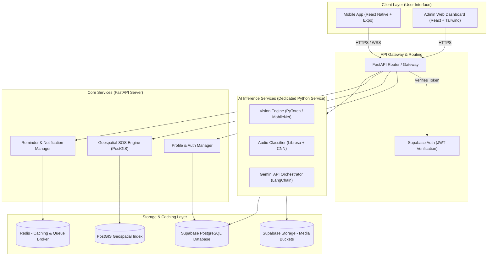
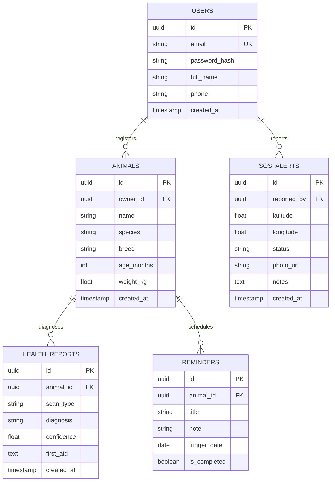
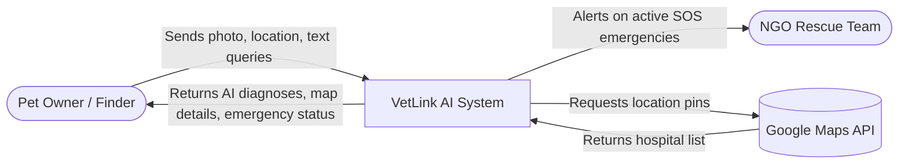
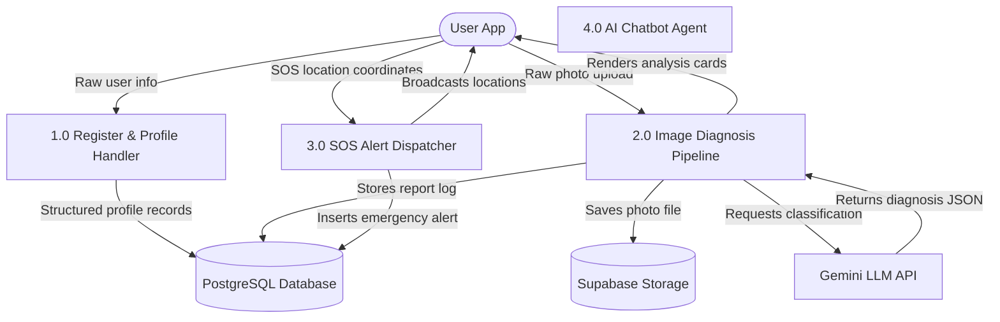
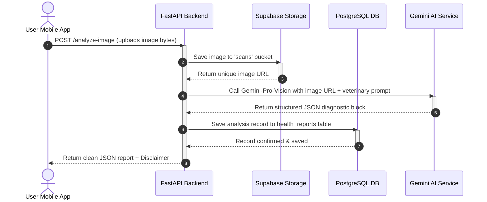

# VetLink AI: Complete Project Blueprint, Roadmap & Academic Guide
### An AI-Powered Animal Healthcare & Stray Rescue Assistant
*Designed for BCA Major Projects, Tech Expos, and Startup MVPs*

> [!NOTE]
> This master blueprint is structured for a BCA student with Python basics. It explains complex architectural, full-stack, and AI concepts using clear, beginner-friendly terminology.

---

## 1. Software Architecture

VetLink AI uses a **Client-Server Architecture** with **decoupled AI services**. Since AI model inference (running image/audio models) uses significant CPU/RAM, keeping it separate from the main application server prevents the mobile app from slowing down or crashing during high usage.



### Component Details
*   **Client Layer**: The user interface. Mobile App handles image captures, GPS locations, and chatbot screens. The Admin Web Dashboard lets NGOs manage active distress alerts.
*   **API Gateway**: The entry point. It checks if the user is authenticated before passing their request to the core services.
*   **Core Services**: The logical modules of our application (managing animal files, mapping locations, scheduled vaccine alerts).
*   **AI Services**: Handles image classification, audio spectrum analysis, and LLM conversations.
*   **Storage Layer**: Supabase PostgreSQL holds user profiles and locations. Supabase Storage handles pictures/sound uploads. Redis tracks instant message queues and fast caching.

---

## 2. System Design

The system runs on two primary communication protocols to keep user interaction fast and responsive:

*   **Request-Response (REST API)**: Used for actions that happen instantly, like logging in, updating a pet's weight, or querying nearby clinics.
*   **Real-time Bi-directional Communication (WebSockets)**: When an SOS alert is triggered, we cannot wait for NGOs to refresh their apps. We open a live WebSocket connection so active alerts instantly broadcast coordinates to the admin dashboard map.
*   **Asynchronous Processing (Task Queues)**: Deep learning inference takes seconds. If a user uploads a video of a dog's limp, the request is offloaded to a queue managed by **Celery** with **Redis**. The user gets a message: *"Video is being processed, you will be notified shortly"*, freeing the main app from freezing.

---

## 3. Feature List (Phased Release)

To launch a working prototype for your Tech Expo in 5 months, build features in three distinct stages:

### Version 1 (Months 1–3: Core MVP)
*   **Animal Profile Manager**: Add species, breed, age, weight, and track vaccination logs.
*   **AI Disease Classifier (Photo Scan)**: Identify common animal skin rashes/lesions using photo analysis.
*   **Emergency SOS Button**: One-tap trigger that uploads GPS coordinates and a distress photo to a public database.
*   **AI Chatbot**: A friendly conversational assistant providing baseline pet care information.
*   **Nearby Directory**: A searchable static list of local veterinary hospitals and animal shelters.

### Version 2 (Month 4: Advanced Features)
*   **AI Distress Sound Classifier**: Record a 5-second sound to classify barking/meowing into *distress*, *pain*, or *normal*.
*   **Dynamic Map Integration**: View nearby vets and active SOS reports on a Google Maps screen.
*   **Reminders System**: Local push notifications prompting the user about medication and vaccine deadlines.
*   **PDF Health Report**: Compile profile data and medical scan history into a neat, exportable health card.

### Version 3 (Month 5 & Beyond: Startup Ready)
*   **AI Gait Analysis (Video Scan)**: Track animal leg joints using video uploads to determine if an animal is limping.
*   **Wearable IoT Smart Collar**: Mock integration showing real-time heart rate and temperature telemetry on the dashboard.
*   **NGO Claim Dashboard**: Interactive portal for verified NGOs to assign volunteers to SOS cases.
*   **Multi-language Support**: Toggle the application between English, Hindi, and regional languages.

---

## 4. Technology Stack & Rationale

*   **Frontend: React Native + Expo**
    *   *Why*: Cross-platform. Write once in JavaScript/TypeScript, run on both Android and iOS. Expo provides easy wrappers to control the phone's camera, microphone, and GPS location.
*   **Backend: FastAPI (Python)**
    *   *Why*: FastAPI is extremely quick to write, performs faster than Django/Flask, and automatically generates interactive API documentation. Writing the backend in Python allows you to import PyTorch or Librosa models directly without setting up multi-language bridges.
*   **Database: Supabase (PostgreSQL + PostGIS)**
    *   *Why*: PostgreSQL is the most stable relational database. Supabase handles database hosting, user login authentication, and media storage, which saves weeks of backend setup. The PostGIS extension enables you to calculate distances between coordinates directly inside the database.
*   **AI/ML: Gemini API & PyTorch**
    *   *Why*: Training custom image models from scratch requires thousands of labeled pictures. For V1, the **Gemini API** analyzes images with excellent general veterinary accuracy. For specialized tasks in V2 (sound analysis), we use **PyTorch** and **Librosa** to process signals locally.
*   **Hosting & Deployment: Render + Supabase**
    *   *Why*: Render hosts FastAPI backends for free/cheap with automated Git deployments. Supabase manages the database.

---

## 5. Frontend Roadmap

To build a professional user interface, follow this learning path:

```
[HTML/CSS/JS Basics] ──> [React Basics & Hooks] ──> [React Native Navigation] ──> [Expo Hardware Access] ──> [API Integrations]
```

1.  **JavaScript Core**: Learn ES6 array map functions, promises, async/await, and object destructuring.
2.  **React Concepts**: Understand functional components, state management (`useState`), and side effects (`useEffect`).
3.  **Expo Setup**: Install Node.js, install Expo CLI, and run your first empty screen on your phone using the Expo Go app.
4.  **Layouts**: Learn Flexbox (how to structure containers, buttons, and cards on mobile screens).
5.  **Hardware Controls**: Integrate `expo-camera` to capture animal photos and `expo-location` to fetch latitude/longitude.
6.  **HTTP Requests**: Use `Axios` to send JSON data and files (multipart/form-data) to the FastAPI server.

---

## 6. Backend Roadmap

This track teaches you how to write the application programming interfaces (APIs) that feed data to your frontend app:

1.  **Python Mastery**: Move beyond basic loops. Learn object-oriented programming (OOP), dictionaries, classes, and decorators.
2.  **FastAPI Setup**: Create endpoints (`@app.get()`, `@app.post()`) and return mock JSON data.
3.  **Data Validation**: Use **Pydantic** models to filter and validate incoming API requests.
4.  **Database Connection**: Use **SQLModel** (or SQLAlchemy) to write Python code that reads and writes Postgres tables without writing raw SQL.
5.  **Auth Integration**: Set up middlewares to read JWT tokens sent from the React Native app to identify which user is calling the API.
6.  **Media Upload Handling**: Configure FastAPI to accept uploaded images, save them to Supabase Storage, and return URLs.

---

## 7. AI/ML Roadmap

Learn how to connect artificial intelligence algorithms to your Python code:

1.  **Foundational Concepts**: Learn what weights, bias, classification, and confidence scores are.
2.  **Gemini API Integration**: Install `google-generativeai`. Write a service that sends an image file and a system prompt (*"Act as a virtual veterinarian..."*) to Gemini and requests a structured JSON response.
3.  **Local Training Setup**: Install PyTorch, NumPy, and Pandas. Learn to load public datasets.
4.  **Model Inference**: Write Python code that loads a saved model (`.pt` or `.pkl`), runs an input through it, and outputs a confidence percentage.

---

## 8. Computer Vision Roadmap

Use this track to develop visual analysis capabilities:

1.  **Image Preprocessing**: Learn to resize, crop, and normalize images using **OpenCV** or **PIL** before feeding them to models.
2.  **Deep Learning Foundations**: Learn how Convolutional Neural Networks (CNNs) extract visual patterns.
3.  **Transfer Learning**: Learn to load a pre-trained network (like **MobileNetV2** or **ResNet50**) and train only the final classification layer on animal skin datasets (mange, ticks, dermatitis).
4.  **Joint Tracking (V3 Feature)**: Experiment with **Google MediaPipe** to extract 3D coordinates of human/animal body parts, then calculate angles between limbs to find walk abnormalities.

---

## 9. Audio Analysis Roadmap

Learn how sound waves are converted into data that a machine learning model can understand:

1.  **Digital Signal Basics**: Learn about sample rates, amplitude, frequencies, and spectrograms.
2.  **Feature Extraction**: Use the **Librosa** library to load `.wav` files and convert them into **MFCCs** (Mel-Frequency Cepstral Coefficients). MFCCs represent sound as a 2D image showing frequency changes over time.
3.  **Model Training**:
    *   *Beginner Approach*: Extract average MFCC values and train a **Random Forest** classifier using Scikit-Learn.
    *   *Advanced Approach*: Convert audio files into spectrogram images and train a 2D CNN (image classifier) to categorize them into classes: *Distress Meow*, *Purr*, *Pain Whimper*, *Alarm Bark*.

---

## 10. Database Design

Below is a relational schema optimized for geo-location queries:

### Users Table (`users`)
*   `id`: UUID (Primary Key)
*   `email`: VARCHAR (Unique)
*   `full_name`: VARCHAR
*   `phone`: VARCHAR
*   `created_at`: TIMESTAMP

### Animals Table (`animals`)
*   `id`: UUID (Primary Key)
*   `owner_id`: UUID (Foreign Key linking to `users.id`)
*   `name`: VARCHAR
*   `species`: VARCHAR (e.g., "Dog", "Cat")
*   `breed`: VARCHAR
*   `age_months`: INTEGER
*   `weight_kg`: FLOAT
*   `vaccination_history`: JSONB (Stores lists of previous vaccines)

### SOS Alerts Table (`sos_alerts`)
*   `id`: UUID (Primary Key)
*   `reported_by`: UUID (Foreign Key linking to `users.id`)
*   `latitude`: DOUBLE PRECISION
*   `longitude`: DOUBLE PRECISION
*   `geom`: GEOMETRY (Point, SRID 4326) — *For high-speed PostGIS geographic indexing*
*   `status`: VARCHAR (e.g., "active", "claimed", "resolved")
*   `photo_url`: VARCHAR
*   `condition_notes`: TEXT

### Health Reports Table (`health_reports`)
*   `id`: UUID (Primary Key)
*   `animal_id`: UUID (Foreign Key linking to `animals.id`)
*   `scan_type`: VARCHAR ("image" | "audio" | "video")
*   `image_url`: VARCHAR
*   `predicted_condition`: VARCHAR
*   `confidence_score`: FLOAT
*   `first_aid_recommendation`: TEXT
*   `created_at`: TIMESTAMP

---

## 11. API Architecture

Here are the details for the main endpoints:

### 1. Photo Diagnosis API
*   **URL**: `/api/v1/ai/analyze-image`
*   **Method**: `POST`
*   **Headers**: `Authorization: Bearer <JWT_TOKEN>`
*   **Body**: `multipart/form-data` (File: `photo`)
*   **API Response (JSON)**:
    ```json
    {
      "success": true,
      "report_id": "9b1deb4d-3b7d-4bad-9bdd-2b0d7b3dcb6d",
      "prediction": "Sarcoptic Mange",
      "confidence": 0.88,
      "symptoms_identified": ["patchy hair loss", "red skin irritation"],
      "first_aid": "Isolate the animal from others. Clean the area with mild antiseptic. Apply vet-recommended anti-parasitic lotion.",
      "disclaimer": "This is an AI estimation and does not replace a physical veterinary diagnosis."
    }
    ```

### 2. SOS Trigger API
*   **URL**: `/api/v1/sos/trigger`
*   **Method**: `POST`
*   **Body (JSON)**:
    ```json
    {
      "latitude": 28.6139,
      "longitude": 77.2090,
      "condition_notes": "Stray dog hit by a car, leg bleeding.",
      "photo_url": "https://supabase-bucket/sos/dog_hit.jpg"
    }
    ```
*   **API Response (JSON)**:
    ```json
    {
      "sos_id": "7a3ceb4d-3b7d-4bad-9bdd-2b0d7b3dcbad",
      "status": "active",
      "message": "SOS broadcasted to nearby rescue centers."
    }
    ```

---

## 12. Folder Structure

```text
vetlink-ai/                  # Root Project Directory
│
├── .github/                 # Git configuration & CI/CD workflows
│
├── frontend/                # React Native Client Code
│   ├── App.js               # Entrypoint
│   ├── app.json             # Expo config
│   ├── package.json         # JS Dependencies
│   └── src/
│       ├── components/      # UI Elements (CustomButton.js, PetCard.js)
│       ├── navigation/      # Navigation config (AppNavigator.js)
│       ├── screens/         # Screens (HomeScreen.js, CameraScreen.js, SOSScreen.js)
│       └── utils/           # Helper scripts (apiClient.js, formatters.js)
│
├── backend/                 # FastAPI Service Code
│   ├── Dockerfile
│   ├── requirements.txt     # Python Dependencies
│   └── app/
│       ├── main.py          # FastAPI Startup
│       ├── api/             # Routers (auth.py, animal.py, ai.py, sos.py)
│       ├── core/            # Configs (config.py, security.py, db.py)
│       ├── models/          # DB Entities (user.py, animal.py, report.py)
│       └── ml/              # Model loaders (load_audio_model.py)
│
└── data-science/            # Local ML Workspaces (Jupyter Notebooks)
    ├── datasets/            # Training metadata
    └── notebooks/           # Sound_Classifier_Training.ipynb
```

---

## 13. UI/UX Screens

Here is a breakdown of the key mobile screens:

1.  **Splash & Onboarding Screen**: Vibrant color theme with brand identity. A warm introduction screen detailing the app's features with options for "Pet Owner Login" or "Guest SOS Mode".
2.  **Home Dashboard**: Displays registered pets in horizontal scroll cards. Quick-access circular buttons for: *Scan Photo*, *AI Chatbot*, *Reminders*, *NGO map*, and a large, floating red *Emergency SOS* button at the bottom center.
3.  **Animal Profile Form**: A form using input fields for Name, Species (selector), Breed (dropdown), Weight slider, and Date of Birth picker. Includes a section to upload vaccines.
4.  **AI Camera Scan Screen**: Real-time camera preview. Guides users with an on-screen oval boundary telling them to: *"Align the affected skin area / lesion inside the frame and hold still"*.
5.  **Scan Results Screen**: Displays the uploaded image, a circular progress ring showing the diagnosis confidence score (e.g., *92%*), list of symptoms, action items for first-aid, a prominent legal **Disclaimer**, and a quick link: *"Find Nearest Clinics"*.
6.  **SOS Alert Interface**: Shows a map showing the user's current GPS location, a camera prompt to capture the emergency situation, and a text box to write condition notes. Clicking "Broadcast" shows a confirmation pulse animation indicating that active volunteers are being notified.
7.  **AI Chatbot Screen**: Classic conversational layout. Displays messages in colored bubbles. Includes quick-tap question prompts at the bottom like: *"What foods are toxic to cats?"* or *"My dog ate chocolate, what should I do?"*.
8.  **Vets & NGOs Map Screen**: Full-screen interactive map displaying nearby veterinary clinics (blue pins) and NGO rescue nodes (green pins) based on the user's location, with direction mapping.

---

## 14. Entity Relationship (ER) Diagram



---

## 15. Data Flow Diagram (DFD)

### DFD Level 0 (System Context)


### DFD Level 1 (Internal Processes)


---

## 16. Use Case Diagram

```mermaid
left_to_right_direction
actor Pet_Owner as "Pet Owner"
actor Guest as "Guest / Stray Finder"
actor NGO_Staff as "NGO Volunteer"
actor System_Admin as "System Admin"

rectangle VetLink_Application_Boundary {
    usecase "Manage Animal Profiles" as UC_Profile
    usecase "AI Diagnostic Photo Scan" as UC_Scan
    usecase "Consult Medical Chatbot" as UC_Chat
    usecase "Trigger Emergency SOS" as UC_SOS
    usecase "Verify and Manage SOS Cases" as UC_NGO
    usecase "Configure Global System Keys" as UC_Admin
}

Pet_Owner --> UC_Profile
Pet_Owner --> UC_Scan
Pet_Owner --> UC_Chat
Pet_Owner --> UC_SOS

Guest --> UC_SOS

NGO_Staff --> UC_NGO
NGO_Staff --> UC_Scan

System_Admin --> UC_Admin
```

---

## 17. Sequence Diagram



---

## 18. Complete Development Roadmap

```
Phase 1 (Setup) ──> Phase 2 (V1 Core MVP) ──> Phase 3 (V2 Sound ML) ──> Phase 4 (Polish & Deploy)
```

1.  **Phase 1: Environment & Layouts (Weeks 1-2)**: Initialize React Native project with Expo, setup FastAPI local server, and configure database connection.
2.  **Phase 2: Authentication & CRUD Profiles (Weeks 3-5)**: Setup login screens, manage profiles, write database schemas, and establish connections.
3.  **Phase 3: Multimodal Vision API Integration (Weeks 6-8)**: Integrate image upload capability to backend, call the Gemini API, parse output, and build UI result cards with disclaimers.
4.  **Phase 4: Maps, Location & SOS Engine (Weeks 9-11)**: Add map screens, integrate geo-location fetching, configure PostGIS for spatial searches, and test the SOS broadcast.
5.  **Phase 5: Audio Deep Learning Pipeline (Weeks 12-15)**: Collect sound datasets, write training scripts in notebooks, export model weights, write backend API for sound classifications.
6.  **Phase 6: Walkthrough, Deployment & Tech Expo Preparation (Weeks 16-20)**: Deploy frontend and backend services, perform system testing, write project documentation, and rehearse the presentation.

---

## 19. Month-by-Month Learning Guide

### Month 1: Frontend & FastAPI Core
*   **Week 1**: JavaScript basics (ES6 variables, callbacks, async calls). Set up Expo and render simple text/buttons on your smartphone.
*   **Week 2**: React Native styling basics (flexbox). Navigate between two screens (Home, Profile) using React Navigation stack.
*   **Week 3**: Python virtual environments, Pip package management, FastAPI routing, and testing using Postman.
*   **Week 4**: Learn Pydantic models to structure and validate incoming API requests. Write your first backend endpoints.

### Month 2: Relational Databases & CRUD
*   **Week 5**: Setup a free database on Supabase. Learn basic relational database concepts: tables, columns, and foreign keys.
*   **Week 6**: Connect your FastAPI backend to Supabase using **SQLModel**. Write endpoints to insert and fetch data from the database.
*   **Week 7**: Integrate Supabase Authentication into your frontend app to handle login and sign-up flows.
*   **Week 8**: Create the pet registration screens, saving pet profile details to the backend database.

### Month 3: Multimodal AI Core (V1 Ready)
*   **Week 9**: Use React Native camera packages to take animal photos and upload files using `FormData`.
*   **Week 10**: Read the official Google Gemini API docs. Connect FastAPI to Gemini-Pro-Vision to send photos with tailored prompts.
*   **Week 11**: Parse the Gemini JSON output. Build beautiful UI cards to display the analysis, including first-aid tips.
*   **Week 12**: Build the SOS trigger: fetch the phone's GPS coordinates, upload a photo, and save the incident to the database.

### Month 4: Audio Analysis & PyTorch ML
*   **Week 13**: Learn about digital audio: sample rates and how sounds are represented. Load audio files in Python using **Librosa**.
*   **Week 14**: Learn how to convert sound signals into **MFCC features**. Train a random forest model using Scikit-Learn to classify distress sounds.
*   **Week 15**: Build a microphone interface in React Native that records audio clips and sends them to the backend server.
*   **Week 16**: Connect the backend to your trained audio model. Test the sound classifier with sample bark and distress recordings.

### Month 5: Deployment, Testing & Prep
*   **Week 17**: Learn how to package your backend server using **Docker** containers.
*   **Week 18**: Deploy your backend to Render or Railway. Set up production environment variables.
*   **Week 19**: Conduct system testing: simulate SOS alerts, check API responses, and run security checks.
*   **Week 20**: Design Tech Expo marketing materials: prepare presentation slides, record a backup demo video, and print QR codes.

---

## 20. Best Free Resources & Courses

*   **Frontend (React Native)**:
    *   *The Net Ninja - React Native Tutorial* (YouTube): Ideal beginner-friendly introduction.
    *   *Expo Documentation* (expo.dev): Highly detailed, copy-pasteable snippets for camera, location, and storage.
*   **Backend (FastAPI & Database)**:
    *   *FastAPI Tutorial User Guide* (fastapi.tiangolo.com): Highly readable documentation with interactive playground.
    *   *Amigoscode - PostgreSQL Crash Course* (YouTube): Beginner-friendly introduction to database queries and relational schemas.
*   **AI, ML & Audio Deep Learning**:
    *   *Andrew Ng - AI for Everyone* (Coursera / YouTube): Essential foundations of AI systems.
    *   *Valerio Velardo - The Sound of AI* (YouTube): The absolute best channel for learning digital signal processing, Librosa, and audio ML.

---

## 21. GitHub Repository Structure

A clean repository structure makes a great impression on college examiners and recruiters. Structure it using separate top-level folders:

*   **Repository Branching Rules**:
    *   `main`: Production-ready code. Only merge after verification.
    *   `dev`: Integration branch where frontend and backend features are merged and tested.
    *   `feature/vision-api`: Short-lived branch used by a team member to build image-scanning capabilities.
*   **Commit Message Guidelines**:
    *   `feat: add profile picture camera upload capability`
    *   `fix: resolve database connection timeout error`
    *   `docs: update API setup instructions in README`

---

## 22. Deployment Guide

Follow these steps to deploy VetLink AI for free:

### 1. Database & Auth (Supabase)
*   Create a project on Supabase.
*   Run the schema commands from the SQL Editor in your dashboard to generate your tables.
*   Copy your `SUPABASE_URL` and `SUPABASE_ANON_KEY` to connect your React Native app.

### 2. Backend Engine (Render)
*   Create a Render account and connect it to your GitHub repository.
*   Select **Web Service** and choose **Docker** as the environment (using the Dockerfile below).
*   Add environment variables in the dashboard: `DATABASE_URL` and `GEMINI_API_KEY`.

#### Dockerfile Example (`backend/Dockerfile`)
```dockerfile
FROM python:3.9-slim

WORKDIR /app

RUN apt-get update && apt-get install -y libsndfile1 ffmpeg && rm -rf /var/lib/apt/lists/*

COPY requirements.txt .
RUN pip install --no-cache-dir -r requirements.txt

COPY . .

CMD ["uvicorn", "app.main:app", "--host", "0.0.0.0", "--port", "8000"]
```

### 3. Frontend App (Expo Dev Client / APK)
*   Configure API endpoints to target your deployed URL (e.g., `https://vetlink-backend.onrender.com`).
*   Run `npx eas build --platform android --profile preview` to build an installable Android APK file.
*   Share the APK file with examiners and colleagues for testing.

---

## 23. Testing Strategy

Ensure VetLink AI functions reliably under different conditions:

*   **API Validation (Backend)**: Write unit tests using **PyTest** to mock your database connections and verify response payloads.
*   **API Performance**: Use **Postman** to build automated tests that check endpoint response times, headers, and status codes.
*   **Offline Handling (Frontend)**: Check how the mobile app behaves when internet access is lost. The UI should display a clean notification rather than crashing.
*   **Multilingual Verification**: Verify that changing target locales translates all main menu headers and system buttons correctly.

---

## 24. Security Considerations

To build a professional app, apply these security guidelines:

*   **API Security**: Implement **Rate Limiting** on endpoints like `/analyze-image` and `/chatbot/chat` to protect against denial-of-service (DoS) attacks and high API bills.
*   **SQL Injection Guard**: Use an ORM like SQLModel. It uses parameterized queries that prevent SQL injection attacks.
*   **Input Sanitization**: Sanitize chatbot text boxes and image inputs to reject malicious payloads.
*   **API Key Protection**: Never commit credentials to GitHub. Always load API keys from environment variables using a `.env` file.

---

## 25. Future Improvements

To expand your college project into a robust enterprise solution, consider these features:

*   **IoT Smart Collar integration**: Embed a DHT11 temperature sensor and a heart rate monitor into a collar, sending metrics via ESP32 to the mobile dashboard.
*   **On-Device AI (Edge Inference)**: Convert your PyTorch models to **ONNX** or **TensorFlow Lite** format to run classification tasks directly on-device without internet access.
*   **Automated NGO Routing**: Implement path-finding algorithms to direct rescue vehicles to SOS incident points.

---

## 26. Startup Opportunities

VetLink AI is a viable startup MVP (Minimum Viable Product):

*   **Freemium Diagnostic Pipeline**: Offer basic chatbot support and scans for free. Provide a subscription tier for immediate telehealth connects to veterinary doctors.
*   **Veterinary Affiliate Network**: Partner with local veterinary clinics, charging commissions for appointments booked through VetLink AI.
*   **Smart Rescue Management B2B Dashboard**: Offer a subscription dashboard to local municipalities and animal NGOs to coordinate street animal rescue dispatches.

---

## 27. Tech Expo Presentation Strategy

Win over examiners with this presentation design:

```text
┌────────────────────────────────────────────────────────┐
│                   VETLINK AI BOOTH                     │
├────────────────────────────────────────────────────────┤
│  [DISPLAY SLIDES]            [LIVE DEMO TABLE]         │
│  - 15-second rescue video     - Tablet showing SOS Map │
│  - Tech Stack diagram         - Test phone with App    │
│  - System accuracy stats      - Speaker for sound demo │
└────────────────────────────────────────────────────────┘
```

1.  **The Hook**: Start with a slide on the street animal crisis. Explain how the app bridges the communication gap between citizens and NGOs.
2.  **Visual Layout**:
    *   Display a clear **QR Code** so visitors can scan and open your web dashboard or download the app.
    *   Show a tablet displaying the real-time SOS dashboard.
3.  **Live Demo**:
    *   Have printed photos of common dog skin issues and play animal sound clips from a speaker to demonstrate the AI features in real-time.
    *   Trigger a live SOS alert on a smartphone and show it appearing instantly on your web dashboard map.

---

## 28. Interview Questions & Answers

These questions are common in college examinations and backend job interviews:

### Q1: Why did you choose FastAPI over Django?
> **Answer**: Django is a "batteries-included" framework, but it is heavy and runs synchronously by default. FastAPI is lightweight, supports Python's `async/await` syntax for concurrent processing, and automatically generates interactive Swagger documentation, which sped up our frontend integration.

### Q2: How does the SOS system calculate the nearest NGOs?
> **Answer**: We use the **PostGIS** extension in PostgreSQL. The backend database stores NGO addresses as geo-coordinate points. When a user sends an SOS, we run a spatial query (`ST_DWithin`) to calculate distances and find matching NGOs within a 10km radius.

### Q3: How did you process sound records in Python for your AI model?
> **Answer**: We used the **Librosa** library to process raw audio signals. We extracted **MFCCs** (Mel-Frequency Cepstral Coefficients), which convert audio waveforms into 2D feature matrices representing frequency distributions over time. These matrices were then used to train our PyTorch classification model.

---

## 29. Resume Points

List this project on your resume using action-oriented bullet points:

*   *Developed and deployed VetLink AI, a full-stack mobile and web application supporting stray rescues and pet health analysis.*
*   *Built a high-performance backend using FastAPI and Supabase, reducing diagnostic processing latencies using async task workers.*
*   *Integrated Gemini API for zero-shot image diagnostics and developed a PyTorch model with Librosa for vocal classification.*
*   *Leveraged PostgreSQL with PostGIS extensions to perform spatial indexing, enabling geographic matching for SOS alerts.*

---

## 30. Research Paper Concept

A published paper adds strong academic value to your profile. Consider this outline:

*   **Title**: *A Lightweight Hybrid Architecture for Mobile Animal Healthcare Diagnostics and Real-time SOS Rescue Dispatches.*
*   **Abstract**: Street animals in developing nations lack access to veterinary care. This paper proposes a lightweight client-server framework to analyze animal sounds and skin conditions using machine learning, alongside a real-time geo-located dispatch system.
*   **Methodology**:
    1.  Image scans are routed to a Multimodal LLM (Gemini API) for general zero-shot classification.
    2.  Local voice scans are processed via Librosa for feature extraction and classified using a PyTorch model.
    3.  SOS dispatches are indexed using PostGIS to locate and notify nearest NGO hubs.
*   **Results**: Focus on measuring classification accuracy, processing latency (in seconds), and memory footprint comparison between local edge models and cloud APIs.
